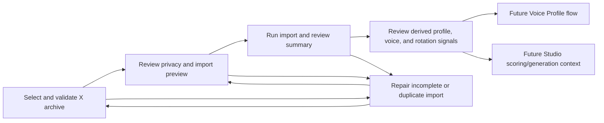

# My X Archive Import Flow Index

Stage: product-flow-map / Stage 2 MAP

Status: draft for review

Source inventory:

- [Feature Inventory](./01-feature-inventory.md)

## Flow List

| # | Flow | Persona | Screens Touched | Depends On |
|---|---|---|---|---|
| 1 | [Select and validate X archive](./02-flows/select-and-validate-x-archive.md) | Founder Writer | Post Library Archive Import Workspace, Tweets File Picker, Archive Validation Preview | Post Library route, selected `tweets.js` file |
| 2 | [Review privacy and import preview](./02-flows/review-privacy-and-import-preview.md) | Privacy-Conscious Local Operator | Archive Validation Preview, Import Boundary Review, Import Preview | file-shape scan |
| 3 | [Run import and review summary](./02-flows/run-import-and-review-summary.md) | Founder Writer | Import Progress Panel, Import Summary, Imported Posts Review Table | safe parser, storage boundary |
| 4 | [Review derived profile, voice, and rotation signals](./02-flows/review-derived-profile-voice-and-rotation-signals.md) | Founder Writer | Derived Insights Review, Import Summary, Studio Route, Voice Route | imported posts, reply corpus, weak metrics, active Studio context |
| 5 | [Repair incomplete or duplicate import](./02-flows/repair-incomplete-or-duplicate-import.md) | Founder Writer, Archive Import Implementer | Archive Validation Preview, Import Progress Panel, Route Error Banner, Settings Route | validation errors, storage/readiness state |

## Screen Usage Matrix

| Screen / Region | Select + Validate | Privacy + Preview | Run + Summary | Derived Review | Repair |
|---|---|---|---|---|---|
| Post Library Archive Import Workspace | Yes | Yes | Yes | Yes | Yes |
| Tweets File Picker | Yes | Partial | No | No | Yes |
| Archive Validation Preview | Yes | Yes | Partial | No | Yes |
| Import Boundary Review | No | Yes | Partial | No | Yes |
| Import Preview | Partial | Yes | No | No | Yes |
| Import Progress Panel | No | No | Yes | No | Yes |
| Import Summary | No | No | Yes | Yes | Partial |
| Imported Posts Review Table | No | No | Yes | Partial | No |
| Derived Insights Review | No | No | Partial | Yes | Partial |
| Route Error Banner | Partial | Partial | Partial | No | Yes |
| Settings Route | No | No | Partial | No | Yes |
| Voice Route | No | No | No | Partial | No |
| Studio Route | No | No | No | Partial | No |

## Cross-Flow Dependencies

## Canonical Screen Names

| Screen | Route | Type |
|---|---|---|
| Post Library Archive Import Workspace | `/library` | Page / workspace |
| Tweets File Picker | `/library` | Native `.js` file input or accessible upload region |
| Archive Validation Preview | `/library` | Panel / table |
| Import Boundary Review | `/library` | Panel / checklist |
| Import Preview | `/library` | Review step |
| Import Progress Panel | `/library` | Progress panel |
| Import Summary | `/library` | Summary panel |
| Imported Posts Review Table | `/library` | Table / list |
| Derived Insights Review | `/library` | Review and activation panel |
| Route Error Banner | route-local | Banner |
| Settings Route | `/settings` | Page |
| Voice Route | `/voice` | Page / future handoff |
| Studio Route | `/writer` | Page |

## Data Categories

| Category | Default | Why |
|---|---|---|
| `tweets.js` | Required | Core posts, replies/comments, timestamps, favorites, retweets. |
| `favorite_count` inside `tweets.js` | Imported | Likes received on authored posts; weak metric. |
| `created_at` inside `tweets.js` | Imported | Cadence, windows, and future cooldown calculations. |
| `like.js` | Deferred | Usually posts the user liked, not received metrics. |
| `tweet-headers.js`, `profile.js`, `account.js`, `follower.js`, `following.js` | Deferred | Separate file imports later if needed. |
| `community-tweet.js`, `note-tweet.js` | Deferred | Needs separate representation decision. |
| `deleted-tweets.js` | Out of v1 | Not relevant to default voice/profile import. |
| Media folders | Out of v1 | No media import. |
| Direct messages, contacts, IP audit, device/security files | Out of scope | Sensitive and not needed for this feature. |

## Assumptions To Validate

- Archive Import starts from Post Library, not Settings or Studio.
- V1 imports an extracted `tweets.js` file only; archive extraction is the user's responsibility.
- The engine owns deterministic parsing and later LLM extraction over reduced parsed data.
- Likes received come from `favorite_count` in `tweets.js`; `like.js` is not a v1 metric source.
- Imported voice/profile/rotation outputs are draft/review states first, then can be activated as Studio context after confirmation.
- X API Sync is separate and should fill impressions/profile clicks later.
