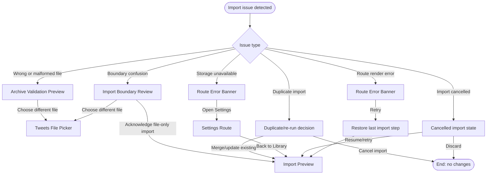

# Flow: Repair Incomplete Or Duplicate Import

## Context

Archive import is file-heavy and trust-sensitive even when v1 reads only `tweets.js`. The user needs recoverable paths for wrong files, malformed data, duplicate re-runs, storage failures, and cancelled imports without losing context.

## Entry Points

- Required file-shape validation fails.
- Duplicate posts are detected in preview.
- Storage readiness fails before or during import.
- User cancels an import.
- Route error occurs while rendering import state.

## Flow Diagram

## Step Descriptions

| # | Step | Description | Screen | Interactions |
|---|---|---|---|---|
| 1 | Identify issue | App classifies the failure as validation, optional-source, duplicate, storage, cancel, or route error. | Route Error Banner / relevant panel | Retry, choose different archive, exclude, open Settings. |
| 2 | Repair wrong or malformed file | User chooses a different `tweets.js` when the selected file is unsupported. | Archive Validation Preview | Choose different file. |
| 3 | Repair boundary confusion | User returns to the file-only explanation when folder/zip/media/deleted imports were expected. | Import Boundary Review | Acknowledge boundary or choose different file. |
| 4 | Resolve duplicate re-run | User merges/updates or cancels. | Import Preview | Merge/update, cancel. |
| 5 | Repair storage | User opens Settings if storage is not writable/available. | Settings Route | Save/test settings, return to Library. |
| 6 | Recover cancelled/route state | User resumes, retries, discards, or restarts. | Import Progress Panel / Route Error Banner | Resume/retry/discard. |

## Error Paths

| Step | Error | User Sees | Recovery |
|---|---|---|---|
| Repair wrong or malformed file | Replacement file also invalid | Same validation panel with updated file summary | Choose again or cancel. |
| Repair boundary confusion | User wants folder/zip extraction | Boundary copy says extraction is manual in v1 | Extract archive manually and select `tweets.js`, or cancel. |
| Resolve duplicate re-run | Merge/update fails during persistence | Import failure with existing data preserved | Retry or cancel. |
| Repair storage | Settings save fails | Settings save error; Library context preserved | Retry save or discard settings edits. |
| Recover cancelled state | Selected file import did not complete | Clear incomplete-state summary | Retry or discard incomplete import attempt. |
| Route render error | Retry throws again | Route Error Banner remains | Open Settings only if readiness-related; otherwise restart import. |

## Edge Cases

- Same file name but different contents: use post IDs/import hash, not only file name, to detect duplicates.
- Same post ID with changed metric counts: keep a new metric snapshot or update according to architecture decision.
- User navigates away mid-import: decide whether import continues in background or prompts before leaving.
- Storage path changes in Settings after preview: require re-check before running import.
- User selects `like.js`, `deleted-tweets.js`, or a media file: show unsupported-file recovery, not privacy toggles.

## Screen References

| Screen | Route | Type | Shared With |
|---|---|---|---|
| Archive Validation Preview | `/library` | Panel / table | select |
| Tweets File Picker | `/library` | Native input / upload region | select |
| Import Boundary Review | `/library` | Panel / checklist | privacy |
| Import Preview | `/library` | Review step | privacy, run |
| Import Progress Panel | `/library` | Progress panel | run |
| Route Error Banner | route-local | Banner | all flows |
| Settings Route | `/settings` | Page | shell/settings |

## Cross-Flow References

- <- [Select and validate X archive](./select-and-validate-x-archive.md) for missing required files.
- <- [Review privacy and import preview](./review-privacy-and-import-preview.md) for boundary and duplicate decisions.
- <- [Run import and review summary](./run-import-and-review-summary.md) for parse/storage/cancel failures.
- -> [Select and validate X archive](./select-and-validate-x-archive.md) when choosing a replacement archive.
- -> [Review privacy and import preview](./review-privacy-and-import-preview.md) after repair returns to import preview.

## Open Questions

- Does import continue if the user navigates away, or should navigation be blocked during active import?
- What exact merge/update semantics should duplicate file imports use?
- Should cancel be allowed after persistence starts, or only before the engine begins writing?

## Metrics / Content / Service Notes

- Primary metric: failed or risky import state recovered without data loss or privacy regression.
- Events to instrument: `archive_import_repair_started`, `archive_duplicate_resolution_selected`, `archive_unsupported_file_selected`, `archive_storage_repair_opened`, `archive_import_recovered`.
- UX copy/content needed: duplicate merge copy, unsupported-file warning copy, storage repair copy, cancelled import copy.
- Backstage dependencies: duplicate detector, selected-file import transaction semantics, settings return path, route error boundary.
- Accessibility-critical states: focus after error, confirmation dialogs if used, clear recovery button labels.
