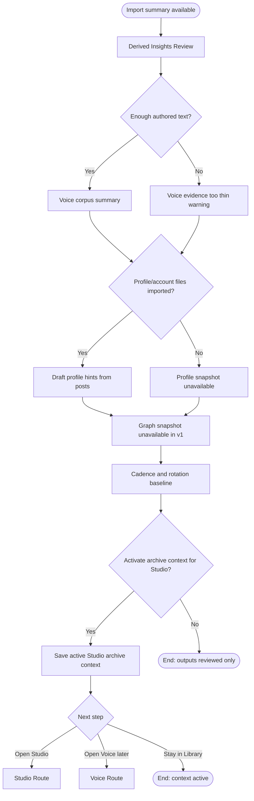

# Flow: Review Derived Profile, Voice, And Rotation Signals

## Context

Importing posts is only useful if the app can use them. This flow reviews draft outputs from deterministic parsing and optional LLM extraction, then lets the user activate a bounded Studio context snapshot without treating it as a final edited voice/profile.

## Entry Points

- Continue from Import Summary after a successful import.
- Open latest import summary from Post Library.
- Future entry from Voice route asking for source posts.

## Flow Diagram

## Step Descriptions

| # | Step | Description | Screen | Interactions |
|---|---|---|---|---|
| 1 | Open derived review | User sees what can be derived from imported archive data. | Derived Insights Review | Open from summary. |
| 2 | Review voice corpus | App summarizes counts for standalone posts and replies/comments, with replies/comments weighted higher for voice. | Derived Insights Review | Inspect source groups. |
| 3 | Review profile hints | App shows draft niche/profile hints inferred from posts and replies, not account-profile truth. | Derived Insights Review | Review, do not auto-apply. |
| 4 | Review graph snapshot | App shows graph snapshot unavailable in v1 because follower/following files are not imported. | Derived Insights Review | Neutral unavailable state. |
| 5 | Review rotation baseline | App shows cadence, likely repeated structures/topics, and emotional-angle candidates as inferred signals. | Derived Insights Review | Inspect inferred groups. |
| 6 | Activate Studio context | User confirms reviewed archive context can influence Studio analysis. | Derived Insights Review | Activate for Studio, keep review-only. |
| 7 | Choose next destination | User can stay in Library or move to Studio/Voice. | Derived Insights Review | Open Studio, Open Voice, stay. |

## Error Paths

| Step | Error | User Sees | Recovery |
|---|---|---|---|
| Review voice corpus | Not enough authored text | Warning: voice extraction needs more authored posts/replies | Use manual examples later or import a fuller archive. |
| Review profile hints | LLM extraction unavailable | Profile hints unavailable; deterministic import remains usable | Continue; rerun extraction later. |
| Review graph snapshot | Follower/following data unavailable in v1 | Neutral unavailable state | Continue; graph sync can come from API or future file import later. |
| Review rotation baseline | Classifier/heuristic unavailable | Baseline unavailable with imported posts still usable | Continue to Library; later engine feature can recompute. |
| Activate Studio context | Derived context is too thin | Activate button disabled with minimum-data explanation | Import fuller `tweets.js` or keep review-only. |
| Open Voice | Voice route still placeholder | Placeholder or future Voice flow | Return to Library or Studio. |

## Edge Cases

- Replies dominate the corpus: highlight that replies are strong voice evidence but weak standalone post-structure evidence.
- Standalone posts may be generated or overly polished: include them for structure/cadence, but do not overweight them for voice.
- Likes received are imported from `favorite_count`, but `like.js` is not used as authored voice or performance metrics in v1.
- Deleted tweets are not imported in v1.
- Emotional angle derivation is uncertain: show as inferred candidate labels, not facts.
- User activates context, then re-imports same file: update active context only after successful merge/update and review.
- User wants full metrics: point to future X API Sync boundary, not archive import.

## Screen References

| Screen | Route | Type | Shared With |
|---|---|---|---|
| Derived Insights Review | `/library` | Review and activation panel | run import |
| Import Summary | `/library` | Summary panel | run import |
| Imported Posts Review Table | `/library` | Table / list | run import |
| Voice Route | `/voice` | Page / future handoff | voice-profile |
| Studio Route | `/writer` | Page | deterministic/writer |

## Cross-Flow References

- <- [Run import and review summary](./run-import-and-review-summary.md) creates the imported records and summary.
- -> Future `voice-profile` flow for editable voice extraction.
- -> Studio/history integration for repeat-history, cooldown, weak metric baselines, and scoring context.
- -> Future `my-feedback-loop` and `my-x-api-sync` for full outcome metrics.

## Open Questions

- Which fields should be included in the active Studio context snapshot?
- What confidence threshold should show voice/profile outputs?
- Should emotional angle labels be computed in archive import or deferred to deterministic/LLM analysis?

## Metrics / Content / Service Notes

- Primary metric: imported archive reviewed and activated for Studio.
- Events to instrument: `archive_derived_review_opened`, `archive_voice_corpus_viewed`, `archive_profile_snapshot_viewed`, `archive_rotation_baseline_viewed`, `archive_context_activated`, `archive_handoff_opened`.
- UX copy/content needed: inferred-signal labels, unavailable states, activate-context copy, API sync boundary copy.
- Backstage dependencies: aggregation service, optional LLM extraction over reduced data, future voice/profile consumers, future repeat-history consumers.
- Accessibility-critical states: grouped summaries, clear heading hierarchy, non-color confidence labels.
