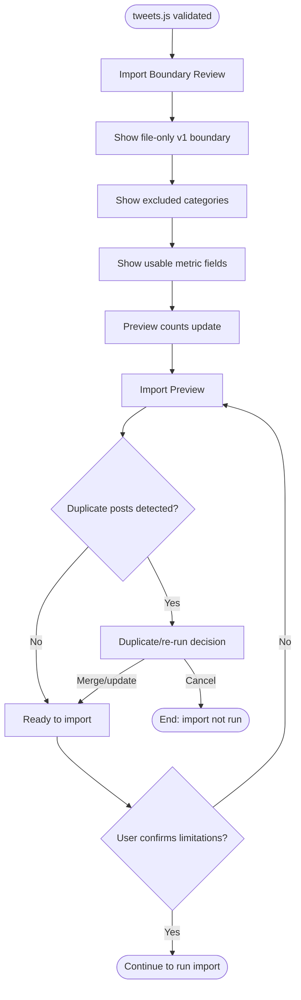

# Flow: Review Privacy And Import Preview

## Context

The full archive contains much more than posts, but v1 only reads the selected `tweets.js` file. Before import, the user needs a clear file-only boundary, a preview of what will be imported, and an honest warning that archive metrics are partial.

## Entry Points

- Continue from successful `tweets.js` validation.
- Return from repair flow after choosing a replacement file.
- Re-open import preview for a previously selected file before running import.

## Flow Diagram

## Step Descriptions

| # | Step | Description | Screen | Interactions |
|---|---|---|---|---|
| 1 | Review file-only boundary | User sees that v1 expects an extracted `tweets.js` file and does not extract folders/zips. | Import Boundary Review | Read-only boundary notice. |
| 2 | Review exclusions | User sees media, deleted tweets, DMs, contacts, device/security files, and other archive files excluded from v1. | Import Boundary Review | Read-only excluded list. |
| 3 | Preview import | App shows expected post/reply counts, favorite/retweet metrics, timestamps, duplicates, and missing metrics. | Import Preview | Review sections. |
| 4 | Handle duplicates | If posts already exist, user chooses merge/update or cancels. | Import Preview | Merge/update choice. |
| 5 | Confirm limitations | User acknowledges archive does not include full analytics like impressions in the inspected shape. | Import Preview | Continue to import. |

## Error Paths

| Step | Error | User Sees | Recovery |
|---|---|---|---|
| Review boundary | User selected folder/zip instead of file | Warning: extract archive and select `data/tweets.js` | Choose different file. |
| Review exclusions | User expects media/deleted/profile/graph import | Boundary notice explains v1 excludes those sources | Continue with `tweets.js` only or cancel. |
| Preview import | Duplicate detection fails | Warning that import can continue but may take longer to dedupe by post id | Continue or cancel. |
| Confirm limitations | User expects impressions from archive | Metrics boundary notice explains archive vs API sync | Continue with partial metrics or cancel. |

## Edge Cases

- User asks about `like.js`: explain that `favorite_count` in `tweets.js` is the received-like metric; `like.js` is usually posts the user liked and is not imported in v1.
- User asks about media: no media files are copied in v1; tweet entities may still indicate link/media presence if present in `tweets.js`.
- User asks about deleted tweets: deleted tweet files are out of v1.
- User cancels after preview: preserve selected file only for the session unless privacy policy says otherwise.

## Screen References

| Screen | Route | Type | Shared With |
|---|---|---|---|
| Import Boundary Review | `/library` | Panel / checklist | repair |
| Import Preview | `/library` | Review step | run import, repair |
| Archive Validation Preview | `/library` | Panel / table | select, repair |

## Cross-Flow References

- <- [Select and validate X archive](./select-and-validate-x-archive.md) provides selected file shape and record counts.
- -> [Run import and review summary](./run-import-and-review-summary.md) after confirmation.
- -> [Repair incomplete or duplicate import](./repair-incomplete-or-duplicate-import.md) for duplicates, unsupported files, or malformed selected files.

## Open Questions

- Should the file-only boundary be its own step or part of the validation preview?
- Should `like.js` be explicitly mentioned as deferred to prevent confusion?
- What exact copy should distinguish ad impression files from organic post impressions?

## Metrics / Content / Service Notes

- Primary metric: validated file advanced to confirmed import preview.
- Events to instrument: `archive_boundary_review_viewed`, `archive_duplicate_detected`, `archive_import_preview_confirmed`.
- UX copy/content needed: file-only boundary copy, excluded-category explanations, metric limitation copy.
- Backstage dependencies: file-shape classifier, duplicate detector, preview aggregator.
- Accessibility-critical states: warning announcement, summary grouping for import counts.
