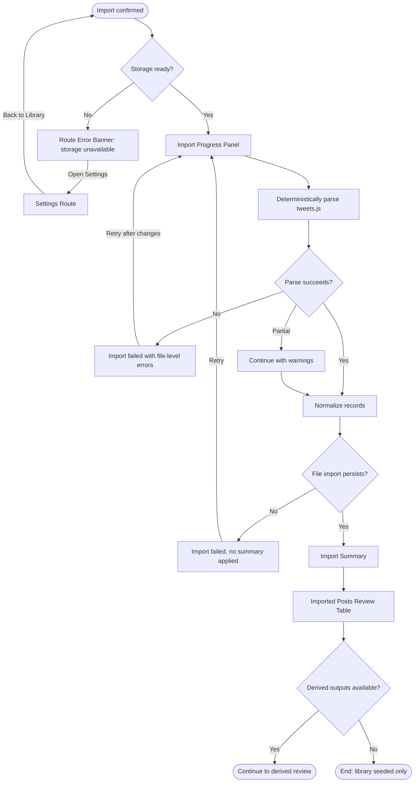

# Flow: Run Import And Review Summary

## Context

After validation and boundary review, the user runs the actual import. The engine deterministically parses the selected `tweets.js`, extracts only the needed posts/replies/comments, timestamps, and weak metrics, then can run LLM extraction over that reduced dataset. The summary makes missing metrics and skipped records obvious.

## Entry Points

- Confirm import from Import Preview.
- Retry from an import failure after repair.
- Re-run the same file with merge/update selected.

## Flow Diagram

## Step Descriptions

| # | Step | Description | Screen | Interactions |
|---|---|---|---|---|
| 1 | Check storage | App confirms local storage/import boundary is ready. | Import Progress Panel / Route Error Banner | Continue or open Settings. |
| 2 | Deterministic parse | Engine parses selected `tweets.js` as data without executing archive JavaScript. | Import Progress Panel | Progress by phase. |
| 3 | Normalize records | Engine maps posts, replies/comments, timestamps, favorites, retweets, and source provenance into app-owned records. | Import Progress Panel | No direct user action. |
| 4 | Optional LLM extraction | LLM runs only over reduced deterministic output when needed for voice/profile/rotation draft insights. | Import Progress Panel | No direct user action. |
| 5 | Persist file import | App writes import run, post records, metric snapshots, and warnings for the selected file as one import unit. | Import Progress Panel | Cancel/retry behavior TBD. |
| 6 | Show summary | User sees imported, skipped, duplicate, excluded, and warning counts. | Import Summary | Review details. |
| 6 | Inspect posts | User can browse a first table/list of imported posts and replies. | Imported Posts Review Table | Filter original/replies, inspect source. |

## Error Paths

| Step | Error | User Sees | Recovery |
|---|---|---|---|
| Check storage | Storage unavailable or unwritable | Route Error Banner with Settings action | Open Settings, fix storage, return to Library. |
| Deterministic parse | Required file parse failure | Import failure with file name and safe retry | Choose different file or retry after repair. |
| Normalize records | Record missing ID or created date | Skipped-record warning | Continue; summary lists skipped count. |
| Optional LLM extraction | LLM unavailable or malformed output | Deterministic import still succeeds; derived insights unavailable | Review imported posts; rerun extraction later. |
| Persist file import | Write failure | Import failed; selected file import is not marked complete | Retry after storage repair. |
| Inspect posts | Imported table cannot render a malformed record | Route-local error for table, summary remains visible | Retry table render; implementation logs record id. |

## Edge Cases

- User cancels mid-import: show that the selected file import did not complete; require retry or discard.
- Archive includes mostly replies/comments: summary should highlight reply-rich corpus as useful for voice, not treat it as low quality.
- Archive includes reposts/retweets: store as references and avoid using as authored voice examples unless text is authored.
- Import produces zero original posts but many replies/comments: allow voice corpus seed but warn that standalone post structure evidence is thin.
- Duplicate re-run finds changed favorite/retweet counts for the same post IDs: update metric snapshot/provenance rather than duplicating posts.

## Screen References

| Screen | Route | Type | Shared With |
|---|---|---|---|
| Import Progress Panel | `/library` | Progress panel | repair |
| Import Summary | `/library` | Summary panel | derived review |
| Imported Posts Review Table | `/library` | Table / list | derived review |
| Route Error Banner | route-local | Banner | repair |
| Settings Route | `/settings` | Page | repair |

## Cross-Flow References

- <- [Review privacy and import preview](./review-privacy-and-import-preview.md) provides selected sources and confirmation.
- -> [Review derived profile, voice, and rotation signals](./review-derived-profile-voice-and-rotation-signals.md) when enough data exists.
- -> [Repair incomplete or duplicate import](./repair-incomplete-or-duplicate-import.md) for storage, parse, cancel, or duplicate issues.

## Open Questions

- Should cancel be supported during parsing/persistence, or only before import starts?
- What table filters are needed before product-flow-spec: original posts/replies/comments/links/highest-liked?
- Which LLM-derived insights, if any, should run during import vs after summary review?

## Metrics / Content / Service Notes

- Primary metric: confirmed `tweets.js` import completed with persisted records.
- Events to instrument: `archive_import_confirmed`, `archive_import_phase_started`, `archive_import_completed`, `archive_import_failed`, `archive_record_skipped`, `archive_llm_extraction_failed`, `archive_summary_viewed`.
- UX copy/content needed: progress phase labels, partial warning copy, summary count labels.
- Backstage dependencies: safe parser, normalizer, dedupe, selected-file import transaction, import-run persistence, optional LLM extraction boundary.
- Accessibility-critical states: progress announcements, retry focus, table keyboard navigation, non-color warning labels.
