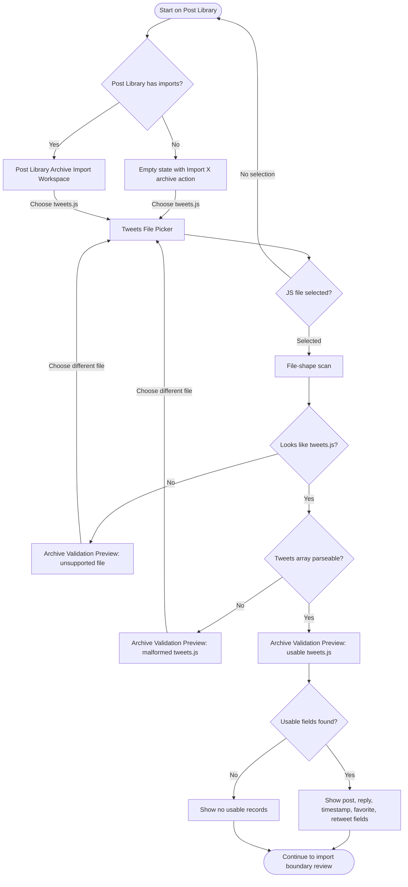

# Flow: Select And Validate X Archive

## Context

A founder has downloaded and extracted an X archive and wants to seed X Builder from historical posts and replies. In v1, the app asks for the extracted `data/tweets.js` file only. The first job is to choose that file, detect whether it is usable, and explain what the app can learn before any import runs.

## Entry Points

- Sidebar Nav: Post Library.
- Post Library placeholder/action: Import X tweets.js.
- Empty Post Library state: Seed from X archive file.
- Return from repair flow after selecting a different file or fixing storage readiness.

## Flow Diagram

## Step Descriptions

| # | Step | Description | Screen | Interactions |
|---|---|---|---|---|
| 1 | Open Post Library | User lands on the Library route, which becomes the source-material workspace. | Post Library Archive Import Workspace | Sidebar or direct `/library`. |
| 2 | Start archive import | User activates import from empty state or workspace action. | Post Library Archive Import Workspace | Import X tweets.js button. |
| 3 | Select file | User selects the extracted `data/tweets.js` file. | Tweets File Picker | Native file input or accessible upload region. |
| 4 | Scan file shape | App detects `window.YTD.tweets.part*`, record count, and usable field names. | Archive Validation Preview | Loading state, then file summary. |
| 5 | Validate required shape | App confirms the file is parseable as a tweets archive export. | Archive Validation Preview | Continue or choose different file. |
| 6 | Show usable fields | App lists posts, replies/comments, timestamps, favorites, retweets, entities, and reply refs if present. | Archive Validation Preview | Proceed to boundary review. |

## Error Paths

| Step | Error | User Sees | Recovery |
|---|---|---|---|
| Select file | User cancels picker | No state change; previous workspace remains | Choose file again. |
| Select file | Browser/app cannot read selected file | Route Error Banner scoped to import | Retry selection. |
| Scan file shape | Selected file is not `tweets.js`-shaped | Validation preview says file is unsupported | Choose different file. |
| Validate required shape | Tweets array cannot be parsed | Required-file error with safe parser details | Choose different file; import disabled. |
| Scan file shape | File too large for preview scan | Warning that counts may be delayed | Continue only if parseable enough to validate. |
| Scan file shape | Archive JS assignment malformed | File-level warning | Continue only if records parse enough to count; otherwise repair flow. |

## Edge Cases

- User selects the archive root, `data/` folder, or zip: reject and explain that v1 expects the extracted `data/tweets.js` file.
- Archive has multiple `tweets.part*` style files in a future export: reject or show unsupported-multipart copy until explicitly supported.
- `tweets.js` has zero records: show no-posts state and keep import disabled.
- User re-selects the same file after a previous import: route to duplicate/re-run decision in repair flow.

## Screen References

| Screen | Route | Type | Shared With |
|---|---|---|---|
| Post Library Archive Import Workspace | `/library` | Page / workspace | all archive flows |
| Tweets File Picker | `/library` | Native input / upload region | repair |
| Archive Validation Preview | `/library` | Panel / table | privacy, repair |
| Route Error Banner | route-local | Banner | repair |

## Cross-Flow References

- -> [Review privacy and import preview](./review-privacy-and-import-preview.md) after required validation succeeds.
- -> [Repair incomplete or duplicate import](./repair-incomplete-or-duplicate-import.md) when required files are missing, malformed, or duplicate.

## Open Questions

- Should the client upload selected file contents to the engine, or collect a user-entered local path for the engine to read?
- Do we need a sample `tweets.js` compatibility test fixture before spec?
- Should unsupported folder/zip selections be detected in the UI or only through validation failure?

## Metrics / Content / Service Notes

- Primary metric: `tweets.js` selected and validated.
- Events to instrument: `archive_import_started`, `tweets_file_selected`, `tweets_file_scanned`, `archive_validation_failed`, `archive_validation_passed`.
- UX copy/content needed: file selection helper, extraction-required helper, required-shape error, usable-field labels.
- Backstage dependencies: selected file transfer to engine boundary, safe parser preflight.
- Accessibility-critical states: native picker labeling, validation summary semantics, scan progress live region.
